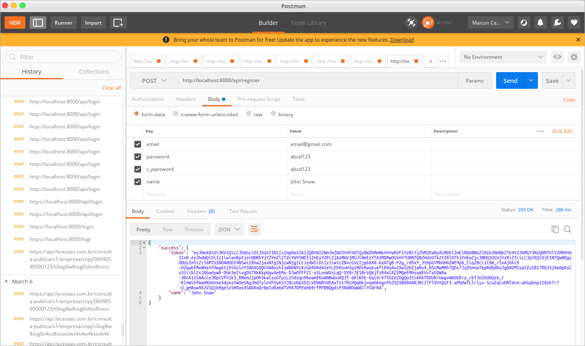
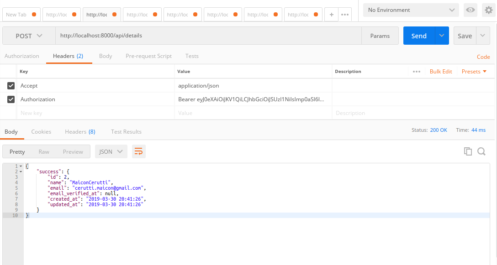
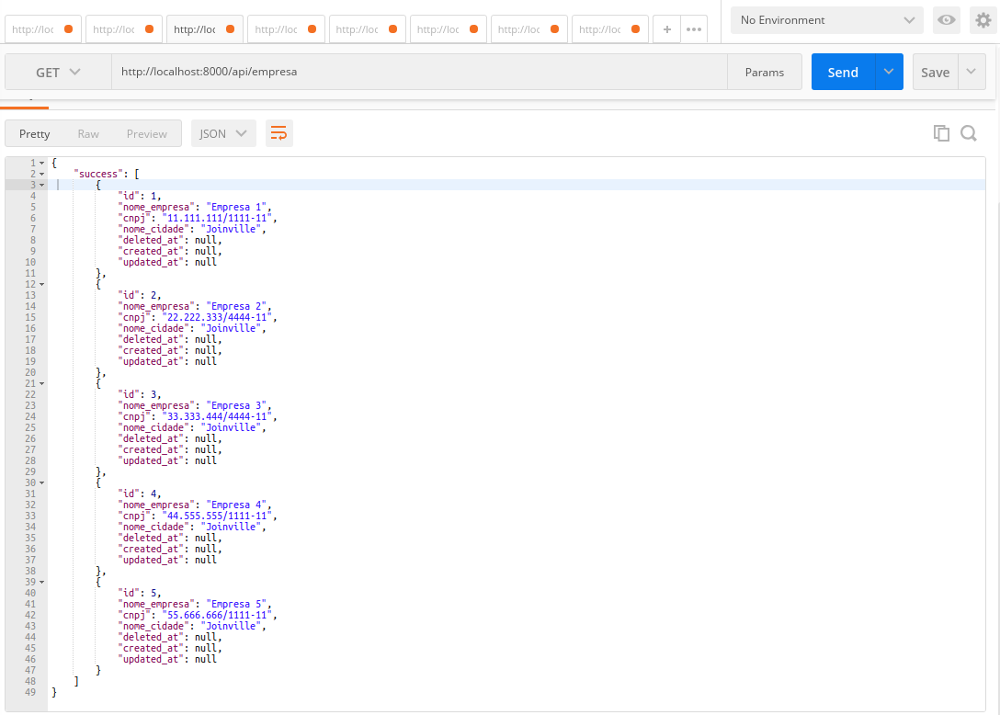
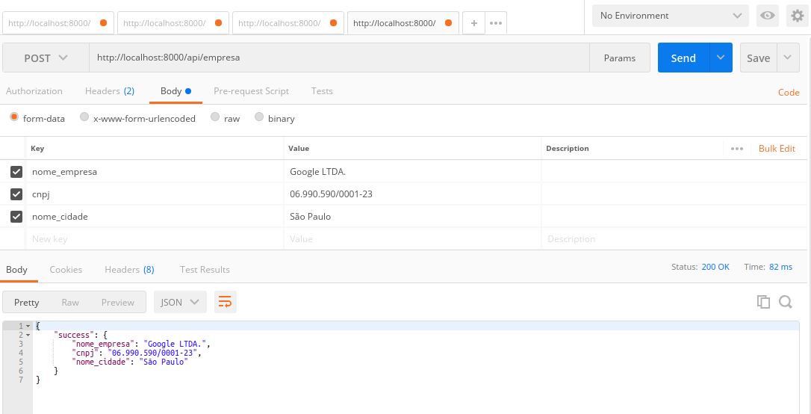
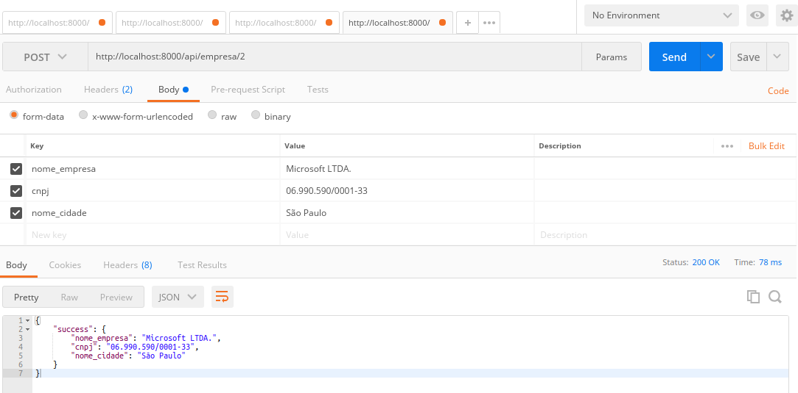
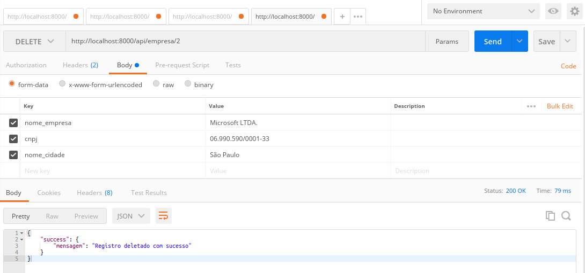

## Propósito do Projeto

O Laravel é um framework de aplicação web com sintaxe expressiva e elegante. Acreditamos que o desenvolvimento deve ser uma experiência agradável e criativa para ser verdadeiramente gratificante. Contudo vou desenvolver com este projeto um CRUD simples para mostrar como funciona uma API com o Laravel utilizando dos tokens forneceidos pelo próprio framework para garantir a segurança dos usuarios que o estão fazendo.

## Fazendo o CRUD de cadastro do usuario para realizar Login no sistema.

Primeiramente precisamos do Laravel Passport instalado no nosso projeto.

    composer require laravel/passport

Depois de instalar o pacote com sucesso, abra o arquivo config/app.php e adicione o provedor de serviços as seguintes linhas de código.

<b>config/app.php</b>

    'providers' =>[
        Laravel\Passport\PassportServiceProvider::class,
    ],

Depois que o provedor de serviços Passport se registra, é necessário executar o comando de migração , após executar o comando de migração, você obterá várias novas tabelas no banco de dados. Então, vamos rodar abaixo do comando:

    php artisan migrate

Em seguida, precisamos instalar um passaporte(chave de autenticação) ele criará chaves de token para a segurança da aplicação. Usando o comando:

    php artisan passport:install
 
 Nesta etapa, temos que fazer a configuração no modelo de três locais, no provedor de serviços e no arquivo de configuração de autenticação. Então você tem que apenas seguir a mudança nesse arquivo.

No model de User adicionamos a chamada de:

<b>app/User.php</b>

    use Laravel\Passport\HasApiTokens;

No arquivo do AuthServiceProvider adicionamos o seguinte:
    
    Passport::routes();

Em auth.php, adicionamos a configuração de autenticação da API.

Os arquivos ficaram da seguinte maneira.

<b>app/User.php</b>

    <?php
    namespace App;
    use Laravel\Passport\HasApiTokens;
    use Illuminate\Notifications\Notifiable;
    use Illuminate\Foundation\Auth\User as Authenticatable;
    class User extends Authenticatable
    {
    use HasApiTokens, Notifiable;
    /**
    * The attributes that are mass assignable.
    *
    * @var array
    */
    protected $fillable = [
    'name', 'email', 'password',
    ];
    /**
    * The attributes that should be hidden for arrays.
    *
    * @var array
    */
    protected $hidden = [
    'password', 'remember_token',
    ];
    }

<b>app/Providers/AuthServiceProvider.php</b>

    <?php
    namespace App\Providers;
    use Laravel\Passport\Passport; 
    use Illuminate\Support\Facades\Gate; 
    use Illuminate\Foundation\Support\Providers\AuthServiceProvider as ServiceProvider;
    class AuthServiceProvider extends ServiceProvider 
    { 
        /** 
        * The policy mappings for the application. 
        * 
        * @var array 
        */ 
        protected $policies = [ 
            'App\Model' => 'App\Policies\ModelPolicy', 
        ];
    /** 
        * Register any authentication / authorization services. 
        * 
        * @return void 
        */ 
        public function boot() 
        { 
            $this->registerPolicies(); 
            Passport::routes(); 
        } 
    }

<b>config/auth.php</b>

    <?php
    return [
    'guards' => [ 
            'web' => [ 
                'driver' => 'session', 
                'provider' => 'users', 
            ], 
            'api' => [ 
                'driver' => 'passport', 
                'provider' => 'users', 
            ], 
        ],

Agora criaremos rotas de API. O Laravel fornece o arquivo api.php para a rota de serviços da Web de gravação. Então, vamos adicionar uma nova rota nesse arquivo.

<b>routes/api.php</b>

    <?php
    /*
    |--------------------------------------------------------------------------
    | API Routes
    |--------------------------------------------------------------------------
    |
    | Here is where you can register API routes for your application. These
    | routes are loaded by the RouteServiceProvider within a group which
    | is assigned the "api" middleware group. Enjoy building your API!
    |
    */
    Route::post('login', 'API\UserController@login');
    Route::post('register', 'API\UserController@register');
    Route::group(['middleware' => 'auth:api'], function(){
        Route::post('details', 'API\UserController@details');
    });

Na última etapa, temos que criar um novo controlador e três métodos de API. Primeiro, crie um novo diretório “API” na pasta Controllers. Então, vamos criar o UserController e colocar o código abaixo:

    <?php
    namespace App\Http\Controllers\API;
    use Illuminate\Http\Request; 
    use App\Http\Controllers\Controller; 
    use App\User; 
    use Illuminate\Support\Facades\Auth; 
    use Validator;
    class UserController extends Controller 
    {
    public $successStatus = 200;
      /** 
        * login api 
        * 
        * @return \Illuminate\Http\Response 
        */ 
        public function login(){ 
            if(Auth::attempt(['email' => request('email'), 'password' => request('password')])){ 
                $user = Auth::user(); 
                $success['token'] =  $user->createToken('MyApp')-> accessToken; 
                return response()->json(['success' => $success], $this-> successStatus); 
            } 
            else{ 
                return response()->json(['error'=>'Unauthorised'], 401); 
            } 
        }
      /** 
        * Register api 
        * 
        * @return \Illuminate\Http\Response 
        */ 
        public function register(Request $request) 
        { 
            $validator = Validator::make($request->all(), [ 
                'name' => 'required', 
                'email' => 'required|email', 
                'password' => 'required', 
                'c_password' => 'required|same:password', 
            ]);
            if ($validator->fails()) { 
                return response()->json(['error'=>$validator->errors()], 401);            
            }
            $input = $request->all(); 
            $input['password'] = bcrypt($input['password']); 
            $user = User::create($input); 
            $success['token'] =  $user->createToken('MyApp')-> accessToken; 
            $success['name'] =  $user->name;
            return response()->json(['success'=>$success], $this-> successStatus); 
        }
      /** 
        * details api 
        * 
        * @return \Illuminate\Http\Response 
        */ 
        
        public function details() 
        { 
            $user = Auth::user(); 
            return response()->json(['success' => $user], $this-> successStatus); 
        } 
    }

Agora estamos prontos para rodar nosso exemplo, então corra abaixo do comando para executar rapidamente:

    php artisan serve

Criamos o projeto com toda a autenticação feita via API e todos os tokens são gravados e feitos dentro da aplicação.

Agora iremos gerenciar um CRUD feito dentro da aplicação via API, cuidando para que exista a validação por TOKEN, garantindo a segurança do usuário.

Eu criei nesta aplicação o mesmo CRUD do elemente que chamei de empresa, seguindo o padrão RESTFULL. 

> OBS: <em>Todos as chamadas por API devem ser feitas dentro da pasta API em controllers por padrão de projeto indicado pelo próprio Laravel.</em>

<b>App/Http/Controllers/API/EmpresaController.php</b>

## CRUD

Agora cuidaremos das funções do CRUD de empresa.

    <?php

    namespace App\Http\Controllers\API;

    use Illuminate\Http\Request;
    use App\Http\Controllers\Controller;
    use App\Empresa;
    use Validator;

    class EmpresaController extends Controller
    {
        public $successStatus = 200;

        /** 
        * Index Empresas API 
        * 
        * @return \Illuminate\Http\Response 
        */ 
        public function index()
        {
            $empresas = Empresa::get();
            return response()->json(['success' => $empresas], $this->successStatus); 
        }

        /** 
        * Store Empresas API 
        * 
        * @return \Illuminate\Http\Response 
        */ 
        public function store(Request $request)
        {
            $validator = Validator::make($request->all(), [ 
                'nome_empresa'  => 'required', 
                'cnpj'          => 'required', 
                'nome_cidade'   => 'required', 
            ]);

            if ($validator->fails()) { 
                return response()->json(['error'=>$validator->errors()], 401);            
            }

            $empresa = Empresa::create($request->all());
            
            $success['nome_empresa']    =  $empresa->nome_empresa; 
            $success['cnpj']            =  $empresa->cnpj;
            $success['nome_cidade']     =  $empresa->nome_cidade;

            return response()->json(['success'=>$success], $this->successStatus); 
        }
        public function show($id)
        {
            $empresa = Empresa::where('id', $id)->get();

            if( count($empresa) == 0 ){
                $success['mensagem']    = "Error 204 - Registro não encontrado"; 
                return response()->json([], 204);
            }
            return response()->json(['success'=>$empresa], $this->successStatus); 
        }

        /** 
        * Update Empresas API 
        * 
        * @return \Illuminate\Http\Response 
        */ 
        public function update(Request $request, $id)
        {

            $validator = Validator::make($request->all(), [ 
                'nome_empresa'  => 'required', 
                'cnpj'          => 'required', 
                'nome_cidade'   => 'required', 
            ]);

            $empresa = Empresa::where('id', $id)->update($request->all());
    
            $success['nome_empresa']    = $request->nome_empresa; 
            $success['cnpj']            = $request->cnpj;
            $success['nome_cidade']     = $request->nome_cidade;

            return response()->json(['success'=>$success], $this->successStatus); 
        }

        public function destroy($id)
        {
            $empresa = Empresa::destroy($id);

            $success['mensagem']    = "Registro deletado com sucesso"; 
        
            return response()->json(['success'=>$success], $this->successStatus); 
        }
    }

Claro que além dos códigos de implementação do CRUD o que realmente deve ser levado em consideração é sabe como é feito a parte de autenticação. Fique feliz em saber que o Laravel já fez isso tudo por você.

<b>App/routes/api.php</b>

    <?php

    use Illuminate\Http\Request;

    /*
    |--------------------------------------------------------------------------
    | API Routes
    |--------------------------------------------------------------------------
    |
    | Here is where you can register API routes for your application. These
    | routes are loaded by the RouteServiceProvider within a group which
    | is assigned the "api" middleware group. Enjoy building your API!
    |
    */

    Route::middleware('auth:api')->get('/user', function (Request $request) {
        return $request->user();
    });

    Route::post('login', 'API\UserController@login');
    Route::post('register', 'API\UserController@register');

    // Route::group(['middleware' => 'auth:api'], function(){
    //     Route::post('details', 'API\UserController@details');
    //     Route::resource('empresa', 'API\EmpresaController');
    
    // });

    Route::group(['middleware' => 'auth:api'], function(){
        Route::post('details', 'API\UserController@details');

        Route::get('empresa', 'API\EmpresaController@index');
        Route::get('empresa/{id}', 'API\EmpresaController@show');
        Route::post('empresa', 'API\EmpresaController@store');
        Route::match(['put', 'patch', 'post'], 'empresa/{id}', 'API\EmpresaController@update');
        Route::delete('empresa/{id}', 'API\EmpresaController@destroy');
    
    });

Este grupo de rotas do middleware é o que garante que para acessar determinada rota o usuario deve estar logado e mandando como parametro o seu token para fazer a autenticação.

## Algumas referências sobre o Padrão RESTFULL

Os códigos mais comuns que você retornará serão:

<b>200</b>: ESTÁ BEM. O código padrão de sucesso e a opção padrão.

<b>201</b>: Objeto criado. Útil para as storeações.

<b>204</b>: Sem conteúdo. Quando uma ação foi executada com sucesso, mas não há conteúdo para retornar.

<b>206</b>: Conteúdo parcial. Útil quando você precisa retornar uma lista paginada de recursos.

<b>400</b>: Pedido ruim. A opção padrão para solicitações que não passam na validação.

<b>401</b>: Não autorizado. O usuário precisa ser autenticado.

<b>403</b>: Proibido. O usuário é autenticado, mas não possui as permissões para executar uma ação.

<b>404</b>: Não encontrado. Isso será retornado automaticamente pelo Laravel quando o recurso não for encontrado.

<b>500</b>: Erro do Servidor Interno. O ideal é que você não retorne isso explicitamente, mas se algo inesperado quebrar, é isso que o usuário receberá.

<b>503</b>: Serviço indisponível. Bastante auto-explicativo, mas também outro código que não será retornado explicitamente pelo aplicativo.

# Testes na API
Para efetuar os testes na minha aplicação será necessário fazer as requisições dos dados seguindo do modelo RESTFULL, utilizando o POSTMAN.

## Registro na API:

Para você se registrar como usuário dentro da minha API basta fazer a seguinte solicitação.

Rota: localhost/api/register

Verbo HTTP: POST

Parâmetros: 'email', 'password'.

Retorno: 'token', 'nome'.

## Login API:

Rota: localhost/api/login

Verbo HTTP: POST

Parâmetros: 'email', 'password'.

Retorno: 'token'

Você receberá como retorno o token, guarde este roken para fazer as proximas requisições dentro da API. Lembre-se que cada usuário tem um token único.

## Detalhes - Usuário

Rota: localhost/api/details

Verbo HTTP: HEAD - Accept && Authorization

Verbo HTTP: POST

Parâmetros: NENHUM

Retorno: 'id', 'nome', 'email', 'email_verified_at', 'created_at', 'updated_at'.

Daqui em diante todos os parâmetros passados no verbo HTTP: HEADER é obrigátorio pois ele faz a autenticação do usuário, caso contrário, você não pode obter detalhes do usuário.

## Empresa - Index

Rota: localhost/api/empresa

Verbo HTTP: HEAD - Accept && Authorization

Verbo HTTP: GET

Parâmetros: NENHUM

Retorno: 'id', 'nome_empresa', 'nome_cidade', 'cnpj', 'deleted_at', 'created_at', 'updated_at'.

## Empresa - Create/Store

Rota: localhost/api/empresa

Verbo HTTP: HEAD - Accept && Authorization

Verbo HTTP: POST

Parâmetros: 'nome_empresa', 'nome_cidade', 'cnpj'

Retorno: 'id', 'nome_empresa', 'nome_cidade', 'cnpj'.

## Empresa - Edit/Update

Rota: localhost/api/empresa/{id}

Verbo HTTP: HEAD - Accept && Authorization

Verbo HTTP: POST/PUT/PATCH

Parâmetros: 'nome_empresa', 'nome_cidade', 'cnpj'

Retorno: 'id', 'nome_empresa', 'nome_cidade', 'cnpj'.

## Empresa - Delete/Destroy

Rota: localhost/api/empresa/{id}

Verbo HTTP: HEAD - Accept && Authorization

Verbo HTTP: DELETE

Parâmetros: id

Retorno: 'Registro deletado com sucesso'.

## License

The Laravel framework is open-source software licensed under the [MIT license](https://opensource.org/licenses/MIT).
